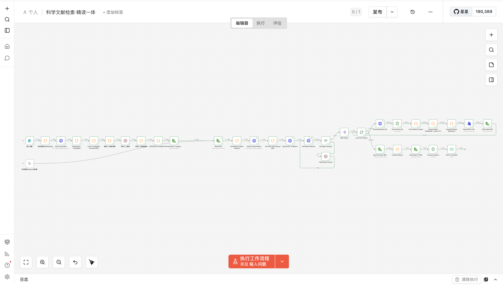
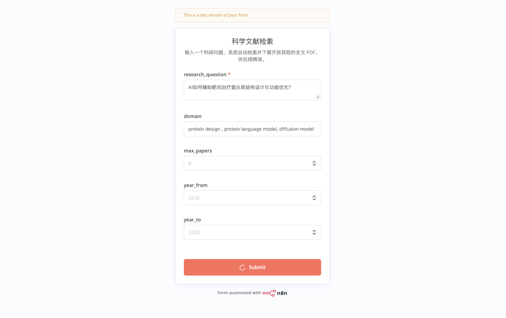
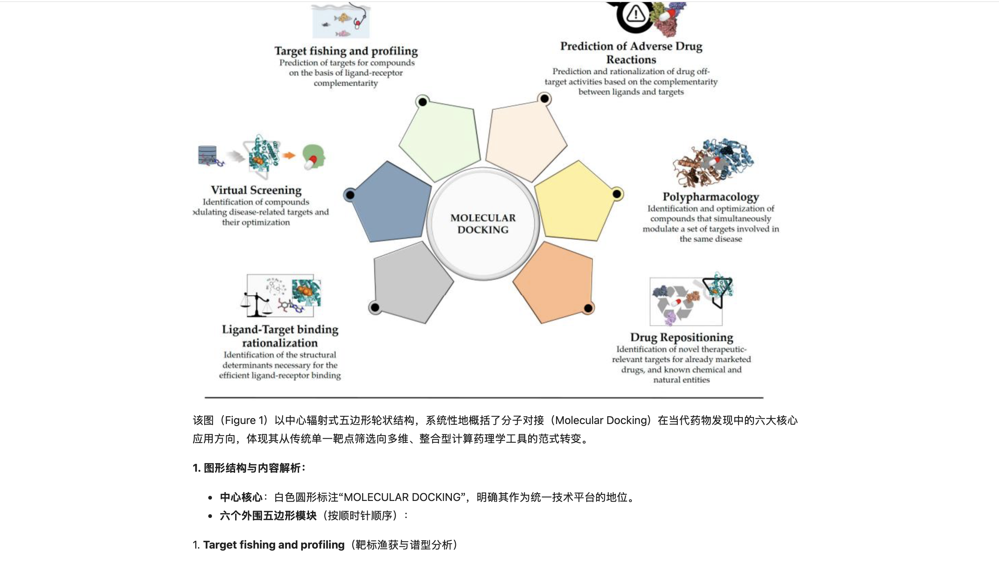
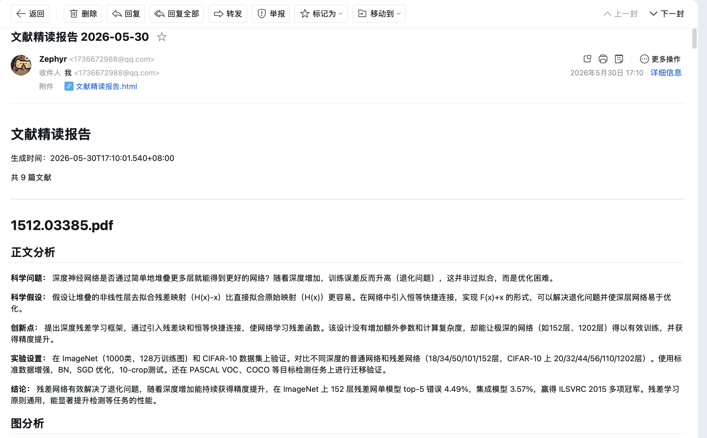

# 科学文献精读自动化工作流（n8n）

输入一个科研问题 → 自动**检索并下载开放获取的全文 PDF** → 每篇论文按 **正文 / 每张图 / 每张表** 三部分精读成**图文并茂的中文报告**（**原图原表在上、分析在下**）→ 打包成 zip 发到 QQ 邮箱。**检索 · 下载 · 精读 · 发信合并在同一个 n8n 工作流**里，纯本地 Docker 运行，密钥只走 `.env`。


<p align="center"><i>整条流水线 33 节点，单工作流端到端跑全绿：检索 → 人工复核 → 下载 → MinerU 解析 → 逐篇精读 → 合并 → 发信。</i></p>

---

## 一图看懂效果

**① 输入一个科研问题（中文也行）**，可选填英文关键词、篇数、年份范围：

<p align="center"></p>

**② 报告图文并茂：原图在上、AI 分析在下**（下图为某篇分子对接综述的「图 1」被精读的效果）：



**③ 报告打成 zip 自动送达 QQ 邮箱**（含可直接浏览器打开的自包含 HTML）：



---

## 技术架构

```mermaid
flowchart LR
  Q["输入问题(表单)"] --> S["DeepSeek检索式 → OpenAlex搜索 → Europe PMC富化"] --> R["人工复核勾选"] --> DL["下载校验PDF → papers/"]
  DL --> A["读 papers/*.pdf"] --> B["MinerU 云端解析"] --> P["轮询完成"]
  P --> D["逐篇循环"]
  D --> E["下载 zip + 解压"] --> F["拆 正文/图/表"]
  F --> G["Analyze Paper<br/>(DeepSeek文本 ∥ Qwen-VL视觉, 并发)"]
  G --> H["拼 Markdown(图表在上·分析在下)"] --> I["写 out/&lt;名&gt;.md"]
  I -- "下一篇" --> D
  I -- "最后一篇" --> J["合并报告 → 轻量转HTML"] --> Z["打 zip + 落 out/"] --> K["发 QQ 邮箱(zip附件)"]
```



| 阶段 | 技术 | 说明 |
|---|---|---|
| **检索** | DeepSeek V4 Pro + OpenAlex + Europe PMC | 问题转 OpenAlex 检索式 → 搜开放获取文献 → Europe PMC 补 PMCID/全文链接 |
| **下载** | n8n Code + `httpRequest` | 候选 PDF 链接按可下载性排序（arXiv → Europe PMC → 出版商）→ 下载后校验 `%PDF` 文件头、失败逐个回退 → 落 `papers/`（**拿到的是完整全文，不是摘要**） |
| **解析** | MinerU 云端 API | PDF → 正文 Markdown + 每张图原图(base64) + 每张表(HTML)，带阅读顺序与 bbox |
| **分析** | DeepSeek V4 Pro（正文+表/文本）· 通义千问 qwen3-vl-plus（图/视觉） | 同一篇内一个 Code 节点用 `Promise.all` 并发发起 1×DeepSeek + N×图视觉（图按 5 张/批） |
| **汇总** | n8n Code + Compression + SMTP | 拼"图表在上·分析在下"Markdown → 逐行轻量转 HTML → **打 zip 附件**发 QQ 邮箱，完整 HTML 同时落 `out/` |

**模型分工**：正文/表走 DeepSeek（表用 MinerU 抽出的 HTML，对数字最精准）；图走 Qwen-VL 真视觉（能"看懂"架构图/流程图，而非套图注）。

**为什么不用 Tavily / arXiv / Semantic Scholar 的搜索 API？** 它们搜回来的多是**摘要**，拿不到完整全文 PDF。本工作流走 OpenAlex 的 `best_oa_location` + `locations[].pdf_url` + Europe PMC 渲染链，**把整篇 PDF 真正下载到本地**再交给 MinerU 解析——这是"精读"而非"读摘要"的前提。

整条流水线 = 单工作流 **33 节点**（检索下载 + MinerU 精读 + 发信），全在本地 n8n 容器内编排，密钥经 `.env` → `$env` 注入，工作流 JSON 不含明文密钥。

## 关键技术点（踩坑记录）

| 问题 | 解法 |
|---|---|
| 搜索 API 只给摘要、拿不到全文 | 不用 Tavily/arXiv/S2 搜索 API；走 OpenAlex OA 链 + Europe PMC，**下载整篇 PDF** 并校验 `%PDF` 头、逐候选回退 |
| MinerU OSS 预签名 `PUT` 上传 403 | 必须**不带 Content-Type**；n8n binaryData 模式强制把 CT 设成文件 mime → 在 Code 里把二进制 `mimeType` 置空使其发空 CT |
| DeepSeek 传图报 `400 unknown variant 'image_url'` | DeepSeek 识图当前仅网页灰度、API 未放开 → 图分析改用阿里云 **qwen3-vl-plus**（OpenAI 兼容，收 base64 `image_url`） |
| `Read PDFs` 6 个 PDF 读出 36 项 | readWriteFile 的 read 会按输入 item 数重复执行 → 节点设 `executeOnce: true` |
| 多篇精读 `Combine Report` **内存溢出(OOM)** | base64 图内联进单个大 HTML + 全管线留存 → 改 Code 节点**输出二进制**（一次成 HTML buffer，去重内联）+ `N8N_DEFAULT_BINARY_DATA_MODE=filesystem`（二进制落盘） |
| QQ SMTP `552 Message too large` | 自包含 HTML 含大量 base64 体积超限 → **Compression 打 zip 附件**（~65% 缩水），完整 HTML 同时写 `out/` 作本地兜底 |
| `N8N_RESTRICT_FILE_ACCESS_TO` 配了不生效 | 该变量按 **`;`** 分隔（不是逗号）→ `/data;/obsidian` |
| 轮询 MinerU 解析完成 | `Loop` + `Get Results(executeOnce)` → `IF length>0 && every done` → 否则 `Wait 8s` 回环；MinerU 相关节点开 `retryOnFail` 防瞬时超时 |
| n8n 节点并发 HTTP | Code 节点里 `this.helpers.httpRequest` + `Promise.all` 可用（task-runner 下实测 OK），用于并发分析 |

## 快速开始

```bash
git clone <repo> && cd kexuewenxianlijie
cp .env.example .env          # 填 MINERU_TOKEN / DEEPSEEK_API_KEY / DASHSCOPE_API_KEY / QQ_SMTP_*
docker compose up -d          # 起 n8n（已配好挂载 / 文件权限 / $env / 防 OOM）
bash scripts/create-qq-credential.sh   # 从 .env 创建 QQ SMTP 凭据（自动绑定到邮件节点）
```

浏览器开 **http://localhost:5678** → 导入 `workflow/litreview-all.json` → 打开 **输入问题** 表单填科研问题（中文也行）→ 在复核表单勾选要精读的文献 → 自动下载 PDF / MinerU 解析 / 分析 / 发邮件，全程一个工作流。

> 已有 PDF 想直接精读（跳过检索）：把 PDF 放进 `papers/`，用工作流里的 **手动精读(papers已就绪)** 触发即可。

**申请 key**：MinerU [mineru.net](https://mineru.net) · DeepSeek [platform.deepseek.com](https://platform.deepseek.com) · 通义千问 [bailian.console.aliyun.com](https://bailian.console.aliyun.com) · QQ 授权码：QQ邮箱 设置 → 账号与安全 → 开启 IMAP/SMTP → 生成授权码（16 位，非登录密码）。

## 自定义

| 想改 | 在哪 |
|---|---|
| 检索式提示词 / 搜索过滤 | `生成检索式(DeepSeek)` / `Search OpenAlex` 节点 |
| PDF 下载候选与回退策略 | `Download & Validate PDF` 节点 Code |
| 分析提示词 / 输出字段 | `Analyze Paper` 节点 Code |
| 报告 / 单篇排版 | `Combine Report` / `Assemble Paper Markdown` 节点 Code |
| 换模型 | `Analyze Paper` 节点里的 `url` / `model`（DeepSeek、Qwen-VL 均 OpenAI 兼容） |
| 图片并发批大小 | `Analyze Paper` 里 `i += 5` 的 `5` |

## 目录结构

```
workflow/litreview-all.json   可导入的 n8n 工作流 JSON（检索 + 精读一体，33 节点）
litreview_workflow.js         工作流 SDK 源码（@n8n/workflow-sdk）
docker-compose.yml            自包含 n8n（挂载 / 文件权限 / $env / 防 OOM 已配好）
.env.example                  密钥模板
scripts/                      一键创建 QQ SMTP 凭据
docs/                         检索下载模块设计与可行性验证记录
static/                       截图（工作流 / 表单 / 报告效果 / 邮件）
papers/ · out/                输入 PDF · 输出 md/html（内容 .gitignore）
1111.png · 科学文献理解.md     原始需求（委托方提供）
```

> 技术栈：MinerU · DeepSeek V4 Pro · 通义千问 Qwen-VL · OpenAlex · Europe PMC · n8n · Docker
