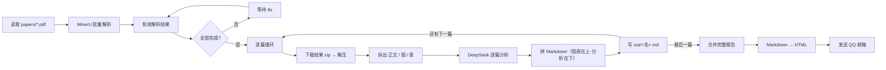

# 科学文献精读自动化工作流（n8n）

一条 **n8n** 工作流：把一批精选的科研 PDF 自动「精读」成一份图文并茂的中文分析报告，并发送到你的邮箱。

每篇论文都会被拆成 **正文 / 每一张图 / 每一张表** 三部分分析，按「**原图（表）在上、分析在下**」的模板排版，逐篇存成 Markdown，最后合并为一份完整报告以 **自包含 HTML 附件** 发到 QQ 邮箱。

> 技术栈：**MinerU**（云端 PDF 解析，抽正文/图/表）+ **DeepSeek V4 Pro**（正文/表格文本分析）+ **通义千问 qwen3-vl-plus**（图片真·视觉分析）+ **n8n**（编排）+ **QQ SMTP**（投递）。全部跑在本地 Docker 里。
>
> 模型分工：正文与表格走 DeepSeek（HTML 表格对数字最精准），每张图走阿里云 Qwen-VL 真·视觉（会真的"看"图）；同一篇内的多张图 + 正文/表格分析**并发**进行以提速。

---

## ✨ 它能做什么

- 📥 读取一个文件夹里的所有 PDF（你的「精选文献库」）
- 🔍 用 MinerU 云端解析每篇 PDF → 正文 Markdown + 每张图的原图 + 每张表（HTML/图）
- 🧠 用 DeepSeek 对每篇做结构化分析：
  - **正文**：科学问题 / 科学假设 / 创新点 / 实验设置 / 结论
  - **每张图**：用 Qwen-VL 真·视觉「看」图，结合标题与全文论述，解读其展示内容与科学意义（多图并发）
  - **每张表**：结合表内容与正文，解读关键数据与结论
- 📝 按「图/表在上、分析在下」拼成 Markdown，逐篇存到 `out/<论文名>.md`
- 📧 合并为完整报告 → 转 HTML → 发到你的 QQ 邮箱

### 流程



### 输出样例（节选）

```markdown
# 1706.03762.pdf

## 正文分析
**科学问题：** 能否仅基于注意力机制构建序列转换模型，摆脱对循环和卷积的依赖？
**创新点：** 首次提出完全不使用循环和卷积、完全依赖注意力的序列转换模型……
**结论：** Transformer 在英德翻译上达到 28.4 BLEU……

## 图分析
### fig-1 — Figure 1: The Transformer - model architecture.

展示 Transformer 整体架构，编码器和解码器各由 N=6 个相同层堆叠……

## 表分析
### tbl-2 — Table 2: ... BLEU scores ...

对比 Transformer 与多种基线模型……训练成本仅为竞争模型的几分之一。
```

---

## 📋 前置要求

| 依赖 | 说明 |
|---|---|
| **Docker** | Docker Desktop / OrbStack / Colima 均可（需能跑 `docker compose`） |
| **MinerU token** | 免费注册 [mineru.net](https://mineru.net) → 申请 API Token |
| **DeepSeek API key** | [platform.deepseek.com](https://platform.deepseek.com) → 创建 key（正文/表格分析，很便宜） |
| **阿里云百炼 DashScope key** | [bailian.console.aliyun.com](https://bailian.console.aliyun.com) → API-KEY（图片视觉分析 qwen3-vl-plus） |
| **QQ 邮箱 + 授权码** | 用于发信（见下方获取方法）；也可改用其它 SMTP 邮箱 |

---

## 🚀 快速开始

```bash
# 1) 克隆仓库
git clone <your-repo-url> kexuewenxianlijie
cd kexuewenxianlijie

# 2) 配置密钥
cp .env.example .env
#   用编辑器打开 .env，填入 MINERU_TOKEN / DEEPSEEK_API_KEY / DASHSCOPE_API_KEY / QQ_SMTP_USER / QQ_SMTP_AUTHCODE

# 3) 放入要精读的 PDF
cp /path/to/your/*.pdf papers/

# 4) 启动 n8n（首次会拉镜像）
docker compose up -d
#   等待就绪：curl -s -o /dev/null -w "%{http_code}\n" http://localhost:5678/healthz  → 200

# 5) 创建 QQ 邮箱凭据（从 .env 自动读取，创建后工作流邮件节点会自动绑定）
bash scripts/create-qq-credential.sh
```

**6) 导入工作流**
浏览器打开 <http://localhost:5678> → 首次会让你创建本地账号 → 左侧 **Workflows** → 右上 **Import from File** → 选 `workflow/litreview-report.json`。

**7) 运行**
打开导入的「科学文献精读报告」工作流 → 右上角 **Execute workflow** → 等几分钟（解析 + 分析）→ 报告自动发到你邮箱。✅

> 想先只验证「报告组装 + 邮件」而不重跑解析？导入 `workflow/report-send-only.json` 并执行，它会读取 `out/` 里已有的 md 直接发邮件（秒级）。

### 获取 QQ 邮箱授权码

QQ邮箱网页版 → **设置 → 账号与安全 → 安全管理** → 开启 **IMAP/SMTP 服务** → **生成授权码**（按提示短信/扫码验证）→ 得到 16 位字母 → 填进 `.env` 的 `QQ_SMTP_AUTHCODE`（**不是** QQ 登录密码）。

---

## 🔧 使用方法 / 自定义

| 想做什么 | 怎么改 |
|---|---|
| **换一批论文** | 清空 `papers/`，放入新 PDF，重新 Execute |
| **改收件人** | 改 `.env` 的 `QQ_MAIL_TO`，然后 `docker compose up -d` 重建容器使其生效 |
| **改分析提示词 / 输出字段** | 编辑 `Analyze Paper (DeepSeek + Qwen-VL)` 节点的 Code（含正文/表 prompt、图视觉 prompt 与 JSON schema） |
| **改正文/图/表的排版** | 编辑 `Assemble Paper Markdown` 节点的 Code |
| **换 LLM / 视觉模型** | 改 `Analyze Paper` 节点 Code 里的 `url`/`model`（DeepSeek、Qwen-VL 均 OpenAI 兼容，可换任意兼容 API） |
| **调图片并发数** | `Analyze Paper` 节点里 `i += 5` 的 `5`（每批并发的图数；大可提速，过大可能触发限流） |
| **换发件邮箱（非 QQ）** | 改 `QQ_SMTP_*` 与 `scripts/create-qq-credential.sh` 里的 `host/port/secure` |
| **定时自动跑** | 把 `Start`（Manual Trigger）换成 Schedule Trigger |

---

## ⚠️ 重要说明（请务必一读）

1. **为什么图用 Qwen-VL、正文/表格用 DeepSeek？**
   DeepSeek V4 Pro 虽是原生多模态，但其 **API 目前还没放开传图**（实测 `chat/completions` 传 `image_url` 直接 `400 unknown variant 'image_url'`，识图只在网页版灰度）。所以图片分析路由到**阿里云通义千问 `qwen3-vl-plus`**（真·视觉，实测能准确读懂论文架构图/流程图）；正文与表格仍走 DeepSeek（表格用 MinerU 抽出的 HTML，对数字最精准）。两者通过 `.env` 各自的 key 调用，都在 `Analyze Paper` 这个 Code 节点里**并发**发起。
   > 想全部用一个模型？把 `Analyze Paper` 节点里的 DeepSeek 调用也换成 `qwen3-vl-plus`（它正文/表格也能做）即可。

2. **完整跑一遍约 3–5 分钟**（MinerU 解析 + 每篇 DeepSeek 思考模式分析）。请在 **n8n 界面里点 Execute** 来跑；如果用外部 API/MCP 触发，可能撞上 ~5 分钟的调用超时被中断。界面手动执行没有这个限制。

3. **密钥安全**：`.env` 已被 `.gitignore` 忽略，不会进 git。密钥通过 docker-compose 的 `env_file` 注入容器，节点里用 `{{ $env.XXX }}` 读取，工作流 JSON 里**不含明文密钥**。

4. **端口/容器名冲突**：若你本机已在跑别的 n8n（占用 5678 或容器名 `n8n`），先改 `docker-compose.yml` 的 `ports`/`container_name`。

---

## 🧩 工作流节点说明（23 节点）

| 阶段 | 关键节点 |
|---|---|
| 取数 | `Read PDFs`（读 `/data/papers/*.pdf`）|
| 解析 | `Build MinerU Batch Request` → `MinerU Submit Batch` → `Pair PDFs With Upload URLs` → `Upload PDF To MinerU`(PUT) → `Get MinerU Results`(轮询) → `All Papers Parsed?`(IF) ↺ `Wait Before Re-poll` |
| 逐篇 | `Split Papers` → `Loop Over Papers` → `Download Result Zip` → `Decompress Zip` → `Parse MinerU Output` |
| 分析 | `Analyze Paper (DeepSeek + Qwen-VL)`（正文/表走 DeepSeek、每图走 Qwen-VL，全部并发）→ `Assemble Paper Markdown` → `Paper MD To File` → `Write Paper MD` |
| 汇总 | `Read All Paper MDs` → `Combine Report` → `Report MD To HTML` → `Report HTML To File` → `Send To QQ Mail` |

源码也提供了 `litreview_workflow.js`（[n8n Workflow SDK](https://docs.n8n.io) 形式），供想用 n8n 原生 MCP 重新生成/二次开发的人参考。

---

## 🛠 故障排查

| 现象 | 排查 |
|---|---|
| `Access to the file is not allowed` | `N8N_RESTRICT_FILE_ACCESS_TO` 必须包含 `/data`（多个目录用 `;` 分隔，**不是逗号**） |
| 上传 MinerU 报 `Forbidden`/`Bad request` | OSS 预签名 URL 拒绝任何非空 `Content-Type`；本工作流已在 `Pair PDFs…` 节点把二进制 `mimeType` 置空规避 |
| 邮件节点 `Node does not have any credentials set` | 跑 `scripts/create-qq-credential.sh`，或在 UI 给 `Send To QQ Mail` 选 `QQ SMTP` 凭据 |
| `$env.XXX` 取不到值 | 确认 `.env` 已填且 `docker compose up -d` 重建过容器；`N8N_BLOCK_ENV_ACCESS_IN_NODE=false` |
| 图分析显示 `(图分析失败…)` | 检查 `.env` 的 `DASHSCOPE_API_KEY` 有效且有额度；`qwen3-vl-plus` 对极小图可能报 400，正常论文配图无碍 |
| 看执行报错详情 | n8n 界面打开该次 execution，点红色节点看输入/输出 |

---

## 📁 目录结构

```
.
├── README.md                     # 本文件
├── docker-compose.yml            # 自包含 n8n（含挂载/env/文件权限）
├── .env.example                  # 密钥模板（复制为 .env 填写）
├── workflow/
│   ├── litreview-report.json     # 主工作流（导入用）
│   └── report-send-only.json     # 仅发送报告的测试工作流
├── scripts/
│   └── create-qq-credential.sh   # 一键创建 QQ SMTP 凭据
├── litreview_workflow.js         # 主工作流的 SDK 源码（进阶/参考）
├── papers/                       # 放输入 PDF（内容 .gitignore）
├── out/                          # 逐篇 md + 报告 html（内容 .gitignore）
├── 科学文献理解.md               # 原始需求说明
└── 1111.png                      # 原始流程手绘图
```

---

## 🙏 致谢

- [MinerU](https://github.com/opendatalab/MinerU)（OpenDataLab）— 高精度 PDF 解析
- [DeepSeek](https://www.deepseek.com) — V4 Pro 大模型（正文/表格分析）
- [通义千问 Qwen-VL](https://bailian.console.aliyun.com)（阿里云百炼）— 图片视觉理解
- [n8n](https://n8n.io) — 工作流编排
